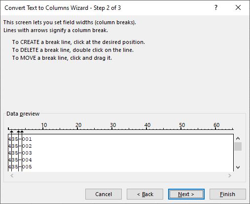

# Text to columns

Nalazi se na Data tab -&gt; Data Tools, pre upotrebe potrebno je selektovati celiju ili kolonu. 


Ne funkcionise na vise kolona. Ukoliko hoces ovo da primenis na vise kolona moras nazalost jednu po jednu selektovati.


Precicu nauci napamet koristices ovo cesto \(pritiskas ih u sekvenci jednu za drugom\):

```text
ALT+A+E
```

Koristi se za: 

* Razdvajanje podataka u celiji
* Promenu tipa podatka

### Razdvajanje podataka

Moze biti sa delimiterom ili fixed width.

Izaberi delimiter po kome hoces da razdvojis podatke 









Ukoliko nije ni jedan od navedenih delimitera, napisi svoj u other, u ovom slucaju stavi \(-\) kao other. Takodje mozes selektovati i vise delimitera.





U ovom slucaju mozemo mu reci da podeli kolonu gde god dodamo liniju. 





Ovaj je isti nezavisno od prethodnog. U donjem prozorcicu vidimo kako nam izgledaju podaci. Selektuj kolonu po kolonu i izaberi gore Data format koji ces primeniti samo na tu kolonu. Default je General koji kao sto pise koristi Excelovu logiku za prepoznavanje sta se nalazi u koloni. 



